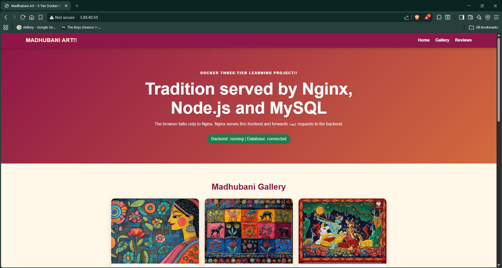
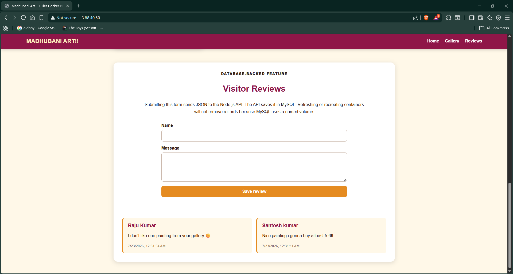
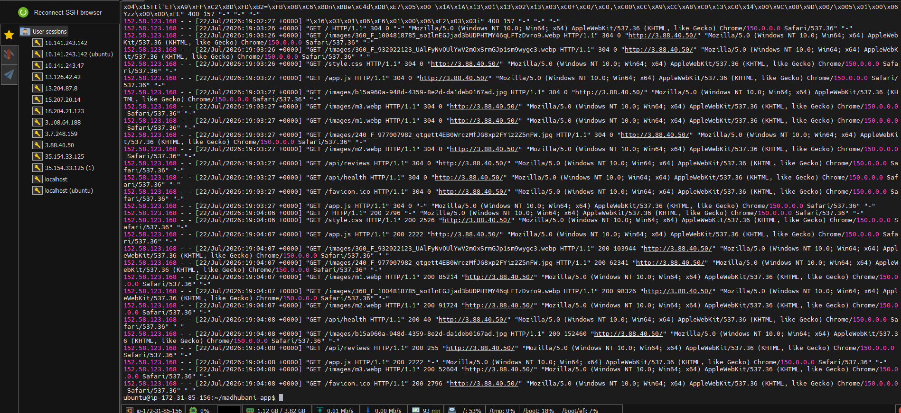
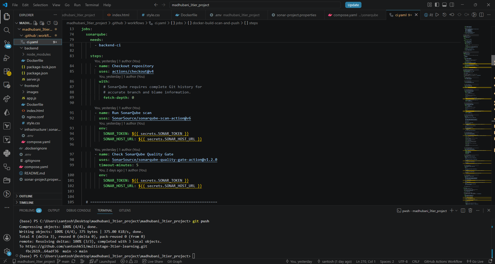
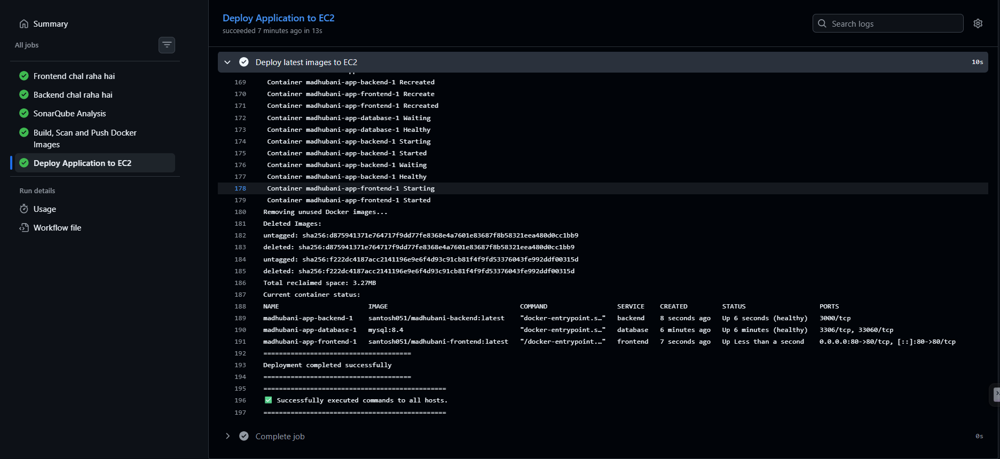
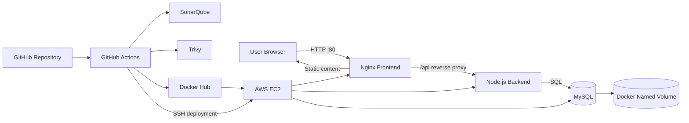
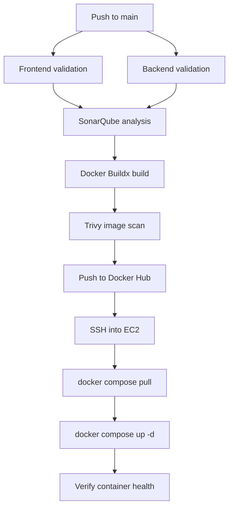

# Madhubani Art — Three-Tier DevOps CI/CD Project

[](https://www.docker.com/)
[](https://github.com/features/actions)
[](https://aws.amazon.com/ec2/)
[](https://nginx.org/)
[](https://nodejs.org/)
[](https://www.mysql.com/)
[](https://www.sonarsource.com/products/sonarqube/)
[](https://trivy.dev/)

A production-style learning project in which I designed, containerized, tested, scanned, published, and automatically deployed a complete three-tier web application to AWS EC2.

> **Recruiter summary:** This project demonstrates hands-on experience with Linux, Docker, multi-stage builds, Docker Compose, container networking, Nginx reverse proxying, Node.js, MySQL, persistent volumes, GitHub Actions, SonarQube, Trivy, Docker Hub, SSH-based deployment, AWS EC2, health checks, logs, and practical troubleshooting.


## Project Screenshots

### Live application on AWS EC2



### MySQL-backed visitor reviews



### Nginx access logs on Ubuntu EC2



### GitHub Actions workflow implementation



### Successful end-to-end deployment



---

## Problem Statement

I wanted to go beyond a simple frontend project and build a system that answers real DevOps questions:

- How can frontend, backend, and database services be packaged independently?
- How can services remain isolated while still communicating?
- How can database records survive container recreation?
- How can code quality and container vulnerabilities be checked before deployment?
- How can Docker images be versioned and pushed automatically?
- How can a successful build be deployed to AWS EC2 without manually logging in?
- How can unhealthy containers, wrong ports, networking failures, and deployment errors be diagnosed?

The final result is a working three-tier application with an automated CI/CD pipeline.

---

## Project Effort

**Duration:** Multiple focused implementation and troubleshooting sessions across several days.

Exact hours were not formally tracked, so I have not claimed an inaccurate number. Most effort went into debugging container health, service networking, Nginx routing, GitHub Actions job dependencies, image scanning, secret management, and EC2 deployment.

---

## Architecture



### Request flow

```text
Browser
   ↓ HTTP on port 80
Nginx frontend container
   ↓ /api requests through reverse proxy
Node.js backend container
   ↓ MySQL protocol
MySQL database container
   ↓ persistent storage
Docker named volume
```

The browser communicates only with Nginx. The backend and database are not directly exposed to the public internet.

---

## CI/CD Flow



```text
Developer
   ↓
Git Push
   ↓
Frontend and Backend Validation
   ↓
SonarQube Analysis and Quality Gate
   ↓
Docker Build
   ↓
Trivy Vulnerability Scan
   ↓
Push Images to Docker Hub
   ↓
SSH into AWS EC2
   ↓
docker compose pull
   ↓
docker compose up -d
   ↓
Application Updated on Port 80
```

---

## Technology Stack

| Area | Technology | Purpose |
|---|---|---|
| Frontend | HTML, CSS, JavaScript | Responsive UI and review form |
| Web server | Nginx | Static hosting and `/api` reverse proxy |
| Backend | Node.js, Express | REST API and database logic |
| Database | MySQL 8.4 | Persistent visitor reviews |
| Containers | Docker | Reproducible application packaging |
| Orchestration | Docker Compose | Multi-service lifecycle and networking |
| CI/CD | GitHub Actions | Validation, scanning, build, push, deployment |
| Code quality | SonarQube | Bugs, code smells, maintainability |
| Security | Trivy | HIGH and CRITICAL image vulnerability scanning |
| Registry | Docker Hub | Stores frontend and backend images |
| Cloud | AWS EC2 Ubuntu | Application hosting |
| Deployment | SSH | Remote deployment from GitHub Actions |
| Version control | Git and GitHub | Source management and workflow trigger |

---

## Repository Structure

```text
madhubani_3tier_project/
├── .github/
│   └── workflows/
│       └── ci.yaml
├── backend/
│   ├── Dockerfile
│   ├── package.json
│   ├── package-lock.json
│   └── server.js
├── frontend/
│   ├── images/
│   ├── Dockerfile
│   ├── index.html
│   ├── style.css
│   ├── app.js
│   └── nginx.conf
├── infrastructure/
│   └── sonarqube/
├── .dockerignore
├── .gitignore
├── compose.yaml
├── sonar-project.properties
└── README.md
```

---

## Key Features

- Nginx-served Madhubani Art frontend
- Node.js REST API
- MySQL-backed visitor review feature
- Persistent database records through a named volume
- `/api/health` health endpoint
- Nginx reverse proxy for browser-to-backend communication
- Separate frontend and backend Docker networks
- Docker health checks and health-based startup dependencies
- Frontend and backend validation in GitHub Actions
- SonarQube code-quality analysis
- Trivy container-image vulnerability scanning
- Docker Hub publishing with `latest` and Git SHA tags
- Automatic deployment to AWS EC2 over SSH
- Deployment status verification using `docker compose ps`
- Log-based troubleshooting using Docker and Nginx logs

---

## Docker Networking Design

```text
frontend-network
    frontend <----> backend

backend-network
    backend <----> database
```

This gives each service only the communication it needs:

- `frontend` can reach `backend`
- `backend` can reach `frontend` and `database`
- `database` is not exposed directly to the internet
- Public traffic enters only through Nginx on port `80`

Docker's internal DNS resolves Compose service names, so the backend uses:

```env
DB_HOST=database
```

instead of `localhost` or a changing container IP address.

---

## Persistent Database

MySQL uses a named volume:

```yaml
volumes:
  - mysql-data:/var/lib/mysql
```

Without the volume, recreating the database container could remove application records. With the volume:

```text
Container recreated
        ↓
Existing mysql-data volume reattached
        ↓
Previous visitor reviews remain available
```

I verified persistence by adding reviews and recreating application containers.

---

## Health Checks

### Backend

```yaml
healthcheck:
  test:
    [
      "CMD",
      "node",
      "-e",
      "fetch('http://127.0.0.1:3000/health').then(r=>{if(!r.ok)process.exit(1)}).catch(()=>process.exit(1))"
    ]
  interval: 10s
  timeout: 5s
  retries: 10
  start_period: 20s
```

### MySQL

```yaml
healthcheck:
  test:
    [
      "CMD",
      "mysqladmin",
      "ping",
      "-h",
      "127.0.0.1",
      "-u",
      "root",
      "-p${MYSQL_ROOT_PASSWORD}"
    ]
  interval: 10s
  timeout: 5s
  retries: 10
  start_period: 30s
```

A running process is not always a ready application. The frontend waits for a healthy backend, and the backend waits for a healthy database.

---

##  Docker Build

The backend uses dependency separation to keep the runtime image cleaner and more efficient.

```dockerfile
FROM nginx:alpine
COPY nginx.conf /etc/nginx/conf.d/default.conf
COPY . /usr/share/nginx/html
EXPOSE 80

```

What I learned:

- Separate dependency installation from runtime
- Reuse Docker layer cache
- Copy only required artifacts
- Reduce final image size and attack surface
- Use `.dockerignore` to exclude `node_modules`, Git files, logs, and unnecessary files

---

## GitHub Actions Jobs

### 1. Frontend validation

```yaml
- name: Verify frontend files
  run: |
    test -f frontend/index.html
    test -f frontend/style.css
    test -f frontend/app.js
    test -f frontend/nginx.conf
    test -f frontend/Dockerfile

- name: Check frontend JavaScript syntax
  run: node --check frontend/app.js
```

### 2. Backend validation

```yaml
- uses: actions/setup-node@v4
  with:
    node-version: "20"
    cache: npm
    cache-dependency-path: backend/package-lock.json

- name: Install dependencies
  working-directory: backend
  run: npm ci

- name: Check backend syntax
  working-directory: backend
  run: node --check server.js
```

### 3. SonarQube

The SonarQube job waits for both validation jobs:

```yaml
needs:
  - frontend-ci
  - backend-ci
```

Complete Git history is checked out for more accurate analysis:

```yaml
with:
  fetch-depth: 0
```

### 4. Docker Buildx

```yaml
- name: Set up Docker Buildx
  uses: docker/setup-buildx-action@v3
```

### 5. Build, load, scan, and push

The images are loaded into the GitHub runner so Trivy can scan them before they are pushed:

```yaml
push: false
load: true
```

Trivy configuration:

```yaml
scanners: vuln
vuln-type: os,library
severity: HIGH,CRITICAL
ignore-unfixed: true
format: table
```

During the learning phase, `exit-code: "0"` allowed the report to be studied without blocking the complete pipeline. A stricter production policy can use `exit-code: "1"`.

Both traceable and convenient image tags are published:

```text
madhubani-frontend:<git-sha>
madhubani-frontend:latest
madhubani-backend:<git-sha>
madhubani-backend:latest
```

---

## Automated AWS EC2 Deployment

The deployment job starts only after image build, scan, and push succeed:

```yaml
deploy-to-ec2:
  needs: docker-build-scan-and-push
```

It deploys only from `main`:

```yaml
if: github.event_name == 'push' && github.ref == 'refs/heads/main'
```

Commands executed remotely:

```bash
set -e
cd /home/ubuntu/madhubani-app
docker compose pull
docker compose up -d --remove-orphans
docker image prune -f
docker compose ps
```

| Command | Purpose |
|---|---|
| `set -e` | Stop deployment when a command fails |
| `docker compose pull` | Download newly pushed images |
| `docker compose up -d` | Recreate changed services in the background |
| `--remove-orphans` | Remove services no longer defined in Compose |
| `docker image prune -f` | Reclaim EC2 disk space |
| `docker compose ps` | Verify service state and health |

The successful GitHub Actions log confirms that MySQL became healthy, the backend became healthy, the frontend started, and port `80` was published.

---

## Secrets and Configuration

GitHub Actions secrets:

```text
DOCKERHUB_USERNAME
DOCKERHUB_TOKEN
SONAR_TOKEN
SONAR_HOST_URL
EC2_HOST
EC2_USERNAME
EC2_SSH_KEY
```

Database values remain in an `.env` file on EC2:

```text
DB_NAME
DB_USER
DB_PASSWORD
MYSQL_ROOT_PASSWORD
```

Secrets are never committed to the repository.

---

## Major Problems I Troubleshot

The strongest DevOps learning came from debugging failures rather than only writing configuration.

### 1. Host port already allocated

**Error:**

```text
Bind for 0.0.0.0:8080 failed: port is already allocated
```

**Cause:** Another container or process already owned the host port.

**Commands used:**

```bash
docker ps
docker ps -a
netstat -ano | findstr :8080
```

**Fix:** Stopped or removed the conflicting container, or changed the host-side port.

**Lesson:** Only one process can bind to the same host IP and port combination.

---

### 2. Backend container unhealthy

**Symptoms:**

```text
backend: unhealthy
Connection refused
```

**Causes investigated:**

- Health check ran before the server was ready
- Health-check command did not exist inside the image
- Wrong internal port
- Wrong host in the check

**Fix:** Used a Node-based request against `127.0.0.1:3000/health` and added retries plus a start period.

**Lesson:** A health check must use tools available inside the image and must target the real listening port.

---

### 3. Backend port mismatch

The application listened on `3000`, while an earlier mapping expected another internal port.

I aligned:

```text
Node.js PORT
Docker EXPOSE
Compose target port
Health-check port
Nginx upstream port
```

**Lesson:** All internal port references must agree.

---

### 4. Nginx could not reach the backend

Using `localhost` inside the Nginx container points back to Nginx, not the backend.

**Fix:** Proxy requests using the Compose service name:

```nginx
location /api/ {
    proxy_pass http://backend:3000;
}
```

**Lesson:** Container-to-container communication uses Docker DNS service names.

---

### 5. MySQL was running but not ready

The backend could start before MySQL accepted connections.

**Fix:** Added a MySQL health check and configured the backend to depend on a healthy database.

**Lesson:** Startup order is different from application readiness.

---

### 6. Database persistence risk

Container filesystems are temporary.

**Fix:** Mounted `mysql-data` at `/var/lib/mysql`.

**Lesson:** Persistent application data must live outside the lifecycle of a single container.

---

### 7. Docker network confusion

Services were running but could not communicate because they did not share the required network.

**Fix:** Connected frontend/backend and backend/database through separate networks and used service names instead of container IPs.

**Lesson:** Container IPs are dynamic; service names are stable.

---

### 8. Duplicate Express declaration

**Error:**

```text
SyntaxError: Identifier 'express' has already been declared
```

**Fix:** Removed the duplicate declaration and added `node --check server.js` in CI.

**Lesson:** Quick syntax checks prevent wasting time on Docker builds that can never run.

---

### 9. Trivy could not scan an unavailable local image

A Buildx build does not automatically make the image available to later runner steps.

**Fix:** Used:

```yaml
push: false
load: true
```

then scanned and pushed the same image.

**Lesson:** Build, load, scan, and push are separate stages.

---

### 10. YAML indentation errors

GitHub Actions YAML is indentation-sensitive. A deployment job was initially placed at the wrong indentation level.

**Fix:** Aligned every job directly under `jobs:` and every step under the correct job.

**Lesson:** YAML indentation is syntax, not decoration.

---

### 11. SonarQube authentication and history

**Fixes:**

- Stored `SONAR_TOKEN` and `SONAR_HOST_URL` in GitHub Secrets
- Used `fetch-depth: 0`
- Ran the Quality Gate after the scan

**Lesson:** CI security and job ordering must reflect real dependencies.

---

### 12. Frontend exited after image update

**Investigation:**

```bash
docker compose ps
docker compose logs frontend
docker image ls
docker pull <frontend-image>
```

**Fix approach:** Verified image names/tags, Nginx configuration, build output, and the `80:80` port mapping before recreating services.

**Lesson:** A successful image push does not guarantee a successful runtime deployment.

---

### 13. Secure EC2 deployment

GitHub Actions required remote access without placing the private key in source control.

**Fix:** Stored `EC2_HOST`, `EC2_USERNAME`, and `EC2_SSH_KEY` as GitHub Secrets.

**Lesson:** Deployment credentials must remain outside the repository.

---

### 14. EC2 disk usage increased after repeated deployments

Old image layers accumulated on the server.

**Fix:** Added:

```bash
docker image prune -f
```

**Lesson:** Operational cleanup is part of deployment automation.

---

### 15. `latest` versus immutable tags

The current server deploys `latest`, while the pipeline also publishes Git SHA tags.

**Trade-off:** `latest` is simple but weaker for rollback and traceability.

**Next improvement:** Deploy the exact Git SHA tag and retain the previous known-good SHA for rollback.

---

## Local Setup

### Prerequisites

- Git
- Docker Engine or Docker Desktop
- Docker Compose v2

### Clone

```bash
git clone https://github.com/santoshsk51/multistage-3tier-learning.git
cd multistage-3tier-learning
```

### Create `.env`

```env
DB_NAME=madhubani_db
DB_USER=madhubani_user
DB_PASSWORD=replace_with_a_strong_password
MYSQL_ROOT_PASSWORD=replace_with_another_strong_password
```

### Validate and run

```bash
docker compose config
docker compose up -d --build
docker compose ps
```

### Test

```bash
curl http://localhost
curl http://localhost/api/health
```

### Logs

```bash
docker compose logs -f
docker compose logs -f backend
```

### Stop

```bash
docker compose down
```

To delete the database volume too:

```bash
docker compose down -v
```

> Warning: `-v` permanently deletes local MySQL data.

---

## Useful Troubleshooting Commands

```bash
docker ps
docker ps -a
docker compose ps
docker compose logs -f
docker compose logs -f backend
docker inspect <container_name>
docker exec -it <container_name> sh
docker network ls
docker network inspect <network_name>
docker image ls
docker system df
docker compose config
docker compose restart backend
docker compose pull
docker compose up -d --remove-orphans
```

---

## What I Learned

### Docker and Compose

- Images versus containers
- Dockerfiles and multi-stage builds
- Build contexts and `.dockerignore`
- Port publishing
- Container networking and DNS
- Named volumes
- Health checks
- Startup dependencies
- Image tags
- Registry authentication
- Image cleanup

### CI/CD

- Workflow triggers
- Jobs, steps, and `needs`
- Parallel validation jobs
- Node.js setup and npm caching
- GitHub Secrets
- Docker Buildx
- Build/load/scan/push lifecycle
- Branch-based deployment rules
- SSH-based remote deployment

### Quality and Security

- SonarQube analysis and Quality Gates
- Trivy OS and library vulnerability scanning
- HIGH and CRITICAL severity filtering
- Secret management
- Limiting publicly exposed services

### AWS and Linux

- EC2 provisioning
- Ubuntu package management
- Security groups
- SSH access
- Docker service management
- Linux user permissions
- Log analysis
- Disk cleanup
- Deployment verification

---

## What This Demonstrates to Recruiters

This project shows that I can:

- Convert an application into independently deployable services
- Design networks around least-required access
- Protect database data during container replacement
- Diagnose failures using logs, health checks, process status, and network inspection
- Build parallel and dependent GitHub Actions jobs
- Integrate quality and security checks before publishing artifacts
- Manage credentials through GitHub Secrets and server-side environment files
- Publish traceable Docker images
- Automate remote AWS EC2 deployment
- Verify service health after deployment
- Explain current limitations and propose production improvements

---

## Current Limitations

- HTTP is enabled, but HTTPS is not yet configured
- The EC2 public IP can change without an Elastic IP
- Deployment currently consumes `latest` tags
- Docker Compose recreation can cause a brief interruption
- MySQL runs on the same EC2 instance rather than Amazon RDS
- Monitoring is currently log-based
- Infrastructure is not yet provisioned with Terraform

Documenting limitations is part of responsible engineering.

---

## Planned Improvements

- Attach an Elastic IP and domain name
- Add HTTPS with Nginx and Let's Encrypt
- Deploy immutable Git SHA tags
- Add automatic rollback on failed health checks
- Add post-deployment smoke tests
- Upload Trivy SARIF results to GitHub Security
- Enforce selected Trivy failures with `exit-code: 1`
- Move MySQL to Amazon RDS
- Use AWS Secrets Manager or SSM Parameter Store
- Add CloudWatch or Prometheus/Grafana monitoring
- Provision infrastructure using Terraform
- Add staging and production environments
- Implement blue-green deployment
- Deploy the application to Kubernetes

---

## Resume-Ready Description

**Madhubani Art Three-Tier DevOps Project**

- Containerized an Nginx frontend, Node.js REST API, and MySQL database using Docker and Docker Compose with isolated networks, health checks, and persistent volumes.
- Built a GitHub Actions CI/CD pipeline for frontend/backend validation, SonarQube analysis, Docker Buildx image creation, Trivy vulnerability scanning, Docker Hub publishing, and automated AWS EC2 deployment over SSH.
- Troubleshot port conflicts, unhealthy containers, service DNS, backend port mismatches, Nginx reverse-proxy failures, MySQL readiness, YAML dependencies, image lifecycle issues, and remote deployment errors.
- Deployed the application on Ubuntu EC2 and verified frontend access, API health, database persistence, container health, and deployment logs.

---

## Interview Explanation

> I built a three-tier Madhubani Art application with an Nginx frontend, Node.js backend, and MySQL database. I containerized every service and used Docker Compose networks so only required services could communicate. MySQL data persists through a named volume, and health checks control readiness. I then created a GitHub Actions pipeline that validates code, runs SonarQube analysis, builds images with Buildx, scans them using Trivy, pushes versioned images to Docker Hub, and deploys them automatically to AWS EC2 through SSH. The most valuable part was troubleshooting real issues such as port conflicts, unhealthy containers, wrong internal ports, Nginx routing, Docker DNS, image availability for scanning, YAML dependencies, and EC2 deployment verification.

---

## Author

**Santosh Kumar**

- GitHub: [santoshsk51](https://github.com/santoshsk51)
- Docker Hub images: `santosh051/madhubani-frontend` and `santosh051/madhubani-backend`
- Target role: DevOps Engineer

---

## Project Lifecycle

```text
Code
→ Validate
→ Analyze
→ Build
→ Scan
→ Publish
→ Deploy
→ Verify
→ Troubleshoot
→ Improve
```
